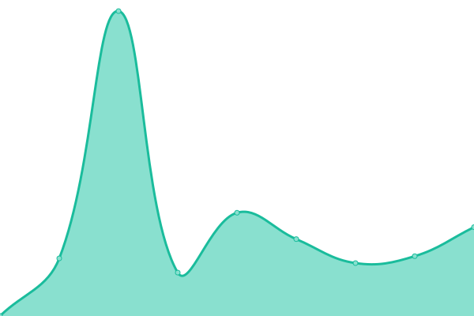

# [📈 Live Status](https://tl-dr-filecoin.github.io/site-status-monitoring): <!--live status--> **🟩 All systems operational**

This repository contains the open-source uptime monitor and status page for [TL;DR Filecoin](https://filecointldr.io), powered by [Upptime](https://github.com/upptime/upptime).

With [Upptime](https://upptime.js.org), you can get your own unlimited and free uptime monitor and status page, powered entirely by a GitHub repository. We use [Issues](https://github.com/tl-dr-filecoin/site-status-monitoring/issues) as incident reports, [Actions](https://github.com/tl-dr-filecoin/site-status-monitoring/actions) as uptime monitors, and [Pages](https://tl-dr-filecoin.github.io/site-status-monitoring) for the status page.

<!--start: status pages-->
<!-- This summary is generated by Upptime (https://github.com/upptime/upptime) -->
<!-- Do not edit this manually, your changes will be overwritten -->
<!-- prettier-ignore -->
| URL | Status | History | Response Time | Uptime |
| --- | ------ | ------- | ------------- | ------ |
|  [TLDR Filecoin](https://www.filecointldr.io) | 🟩 Up | [tldr-filecoin.yml](https://github.com/TL-DR-Filecoin/site-status-monitoring/commits/HEAD/history/tldr-filecoin.yml) | 

 2668ms
     
 | 

<a href="https://tl-dr-filecoin.github.io/site-status-monitoring/history/tldr-filecoin">54.97%</a>
    

|  [TLDR Filecoin Blog](https://www.filecointldr.io/blog) | 🟩 Up | [tldr-filecoin-blog.yml](https://github.com/TL-DR-Filecoin/site-status-monitoring/commits/HEAD/history/tldr-filecoin-blog.yml) | 

 548ms
     
 | 

<a href="https://tl-dr-filecoin.github.io/site-status-monitoring/history/tldr-filecoin-blog">0.00%</a>
    

|  [TLDR Filecoin How to Stake FIL](https://www.filecointldr.io/how-to-stake-filecoin) | 🟩 Up | [tldr-filecoin-how-to-stake-fil.yml](https://github.com/TL-DR-Filecoin/site-status-monitoring/commits/HEAD/history/tldr-filecoin-how-to-stake-fil.yml) | 

 1221ms
     
 | 

<a href="https://tl-dr-filecoin.github.io/site-status-monitoring/history/tldr-filecoin-how-to-stake-fil">0.00%</a>
    

|  [TLDR Filecoin How to Buy FIL](https://www.filecointldr.io/how-to-buy-filecoin) | 🟩 Up | [tldr-filecoin-how-to-buy-fil.yml](https://github.com/TL-DR-Filecoin/site-status-monitoring/commits/HEAD/history/tldr-filecoin-how-to-buy-fil.yml) | 

 669ms
     
 | 

<a href="https://tl-dr-filecoin.github.io/site-status-monitoring/history/tldr-filecoin-how-to-buy-fil">0.00%</a>
    

|  [TLDR Filecoin Views and Research](https://www.filecointldr.io/views-and-research) | 🟩 Up | [tldr-filecoin-views-and-research.yml](https://github.com/TL-DR-Filecoin/site-status-monitoring/commits/HEAD/history/tldr-filecoin-views-and-research.yml) | 

 1197ms
     
 | 

<a href="https://tl-dr-filecoin.github.io/site-status-monitoring/history/tldr-filecoin-views-and-research">55.03%</a>
    

|  [TLDR Filecoin Terms & Conditions](https://www.filecointldr.io/terms) | 🟩 Up | [tldr-filecoin-terms-and-conditions.yml](https://github.com/TL-DR-Filecoin/site-status-monitoring/commits/HEAD/history/tldr-filecoin-terms-and-conditions.yml) | 

 251ms
     
 | 

<a href="https://tl-dr-filecoin.github.io/site-status-monitoring/history/tldr-filecoin-terms-and-conditions">55.04%</a>
    

|  [TLDR Filecoin Privacy Policy](https://filecointldr.io/privacy-policy) | 🟩 Up | [tldr-filecoin-privacy-policy.yml](https://github.com/TL-DR-Filecoin/site-status-monitoring/commits/HEAD/history/tldr-filecoin-privacy-policy.yml) | 

 148ms
     
 | 

<a href="https://tl-dr-filecoin.github.io/site-status-monitoring/history/tldr-filecoin-privacy-policy">55.24%</a>
    

<!--end: status pages-->

[**Visit our status website →**](https://tl-dr-filecoin.github.io/site-status-monitoring)

## 📄 License

- Powered by: [Upptime](https://github.com/upptime/upptime)
- Code: [MIT](./LICENSE) © [TL;DR Filecoin](https://filecointldr.io)
- Data in the `./history` directory: [Open Database License](https://opendatacommons.org/licenses/odbl/1-0/)
